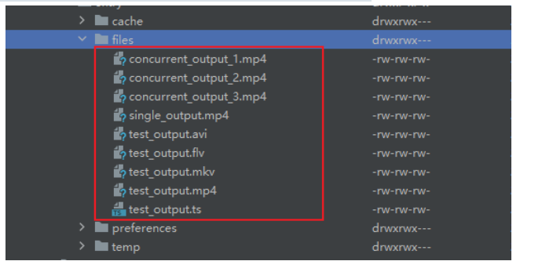

# @prq/ffmpeg-tools

HarmonyOS FFmpeg 工具库 —— 在鸿蒙中调用 FFmpeg 命令行工具（fftools），最终驱动 FFmpeg.so 执行音视频处理任务。

## 安装

```bash
ohpm install @prq/ffmpeg-tools
```

## 特性

本库的核心能力是将 FFmpeg 命令行工具封装为 ArkTS 可调用的 Native 接口，支持：

- 视频格式转换（MP4、FLV、AVI、MKV、TS）
- 音频提取（MP3、AAC）
- 网络流媒体下载
- 优先级任务队列
- 进度回调
- 任务取消

## 功能验证

已测试从网络 MP4 下载并转换为 `mkv`、`avi`、`mp4` 等格式，输出结果正常可用。

**示例执行命令：**
```
ffmpeg -i https://example.com/video.mp4 -c:v copy -c:a copy -f avi -y /data/storage/el2/base/haps/entry/files/output.avi
```

**性能统计：**
- 原视频大小：4981937 字节（约 4.75MB），时长 2 分钟
- MP4 → MP4（copy）：耗时 0.42s，输出 4981937 字节
- MP4 → MKV（copy）：耗时 0.35s，输出 4831.78 KB

**示例结果：**

- 进行多个格式转换
    - 
- 提取到电脑上播放
    - 

## 快速开始

### 基本使用

```typescript
import { FFmpegManager, FFmpegFactory, TaskCallback } from '@prq/ffmpeg-tools';

// 获取管理器实例
const manager = FFmpegManager.getInstance();

// 执行视频转换
const taskId = manager.execute(
  FFmpegFactory.buildMp42Flv(inputPath, outputPath),
  120000, // 超时时间（毫秒）
  {
    onStart: () => {
      console.log('任务开始');
    },
    onProgress: (progress: number) => {
      console.log(`进度: ${(progress * 100).toFixed(1)}%`);
    },
    onSuccess: () => {
      console.log('转换成功');
    },
    onFailure: () => {
      console.log('转换失败');
    }
  } as TaskCallback
);

// 取消任务
manager.cancel(taskId);
```

### 支持的格式转换

```typescript
import { FFmpegFactory } from '@prq/ffmpeg-tools';

// 视频格式转换
FFmpegFactory.buildMp42Flv(input, output);  // MP4 → FLV
FFmpegFactory.buildMp42Avi(input, output);  // MP4 → AVI
FFmpegFactory.buildMp42Mkv(input, output);  // MP4 → MKV
FFmpegFactory.buildMp42Ts(input, output);   // MP4 → TS
FFmpegFactory.buildMp42Mp4(input, output);  // 视频复制

// 音频提取
FFmpegFactory.buildExtractMp3(input, output);  // 提取 MP3
FFmpegFactory.buildExtractAac(input, output);  // 提取 AAC
```

### 自定义命令

```typescript
import { FFMpegUtils } from '@prq/ffmpeg-tools';

FFMpegUtils.executeFFmpegCommand({
  cmds: ['-i', inputPath, '-c:v', 'libx264', '-c:a', 'aac', outputPath],
  onFFmpegProgress: (progress) => {
    console.log(`进度: ${progress}%`);
  },
  onFFmpegFail: (code, msg) => {
    console.error(`失败: ${code} - ${msg}`);
  },
  onFFmpegSuccess: () => {
    console.log('成功');
  }
});
```

## 实现方案

### 总体思路

将 FFmpeg 命令行工具（fftools）封装为 ArkTS 可调用的 Native 库，ArkTS 以 API 形式驱动常见转码/下载任务。

### 跨语言通信

采用 **AKI 框架** 实现 ArkTS（ETS） ⇄ C++ 的双向调用：

- **ETS → Native**：通过 `JSBIND_PFUNCTION` 宏将执行接口注册到 ArkTS；请求进入 Native 后由框架投递到线程池执行
- **Native → ETS**：通过带 `UUID` 的回调机制上报任务进度与最终结果，回调可以把异步状态传回 ETS 层

### FFtools 源码改造

- 原 FFmpeg 在严重错误时会调用 `exit()` 导致进程退出
- 为避免影响宿主进程，已将 `exit_program()` 改为基于 `setjmp/longjmp` 的非局部跳转方案，使出错时能优雅返回错误码并由上层处理（而非终止进程）
- **状态隔离**：Native 层使用 `thread_local` 来尽可能隔离每个任务的局部状态，避免不同任务互相污染

### 并发处理

实测发现：FFmpeg 内部仍大量依赖全局变量与共享状态——因此不适合在同一进程内多线程并发执行多个 FFTools 实例；并发运行会导致互相干扰、崩溃或数据错乱。

**当前策略**：任务调度层通过限制工作线程数量为 1，保证串行执行。

## API

### FFmpegManager

| 方法 | 说明 |
|------|------|
| `getInstance()` | 获取单例实例 |
| `execute(commands, duration, callback)` | 执行任务 |
| `executeWithPriority(commands, duration, priority, callback)` | 带优先级执行 |
| `cancel(taskId)` | 取消任务 |
| `cancelAll()` | 取消所有任务 |
| `getPendingTaskCount()` | 获取等待任务数 |
| `getActiveTaskCount()` | 获取活动任务数 |

### TaskCallback

| 回调 | 说明 |
|------|------|
| `onStart()` | 任务开始 |
| `onProgress(progress)` | 进度更新 (0-1) |
| `onSuccess()` | 任务成功 |
| `onFailure()` | 任务失败 |
| `onCancelled?()` | 任务取消 |
| `onTimeout?()` | 任务超时 |
| `onError?(error)` | 错误信息 |

### TaskPriority

| 优先级 | 说明 |
|--------|------|
| `HIGH` | 高优先级 |
| `NORMAL` | 普通优先级（默认） |
| `LOW` | 低优先级 |

## 使用注意事项

1. **网络权限**：访问网络 URL 需要在 `module.json5` 中添加权限：
   ```json5
   "requestPermissions": [
     { "name": "ohos.permission.INTERNET" }
   ]
   ```

2. **包体积优化**：当前 `libffmpegutils.so` 约 70MB（依赖完整 FFmpeg 库）
    - 建议在 `module.json5` 中开启压缩：`"compressNativeLibs": true`
    - 可参考华为官方方案进行拆分与裁剪：[华为开发者博客](https://developer.huawei.com/consumer/cn/blog/topic/03171278604140060)

3. **架构支持**：仅支持 arm64-v8a 架构

4. **系统要求**：HarmonyOS 5.0+ (API 12+)

5. **并发限制**：FFmpeg 内部使用全局变量，不支持多线程并发执行，任务会串行处理

6. **当前优化：**

    1. 优化包体积管理，aki通过依赖引入，其自带了多个架构的so文件，nativeLib 配置来过滤无用的架构

       ```
       "buildOption": {
           "napiLibFilterOption": {
             "excludes": [
               "**/armeabi-v7a/**",
               "**/x86_64/**"
             ]
           }
         },
       ```

## 相关文档

- [FFmpegUtils 实现思路](https://blog.csdn.net/qq_35829566/article/details/155782443?sharetype=blogdetail&sharerId=155782443&sharerefer=PC&sharesource=qq_35829566&spm=1011.2480.3001.8118) <!-- TODO: 补充链接 -->
- [鸿蒙下 FFmpeg 编译流程](https://blog.csdn.net/qq_35829566/article/details/155781896?sharetype=blogdetail&sharerId=155781896&sharerefer=PC&sharesource=qq_35829566&spm=1011.2480.3001.8118) <!-- TODO: 补充链接 -->

## License

MIT
