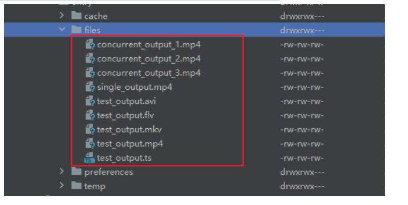
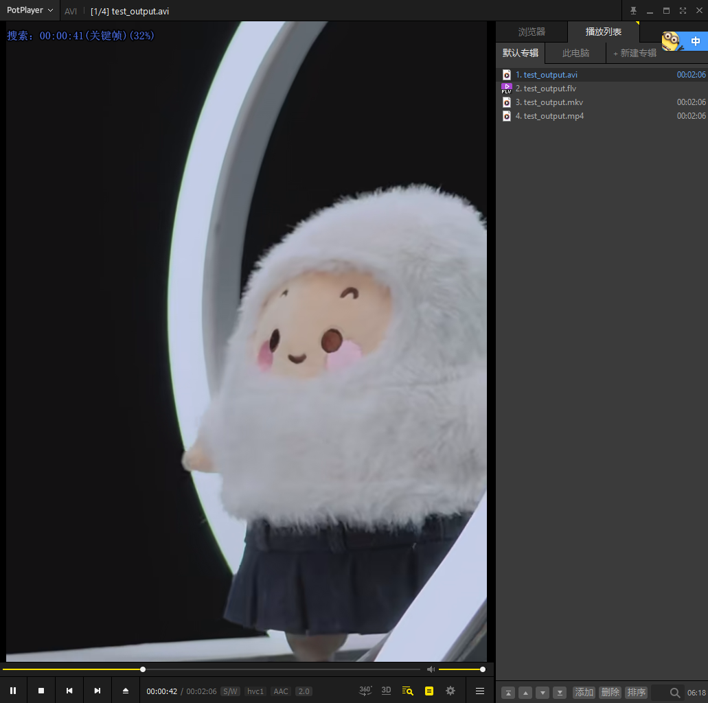
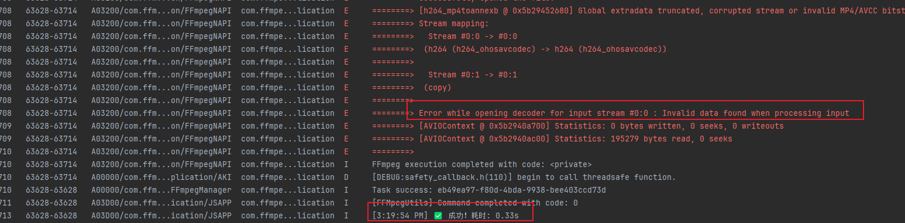

# @prq/ffmpeg-tools

HarmonyOS FFmpeg 工具库 —— 在鸿蒙中调用 FFmpeg 命令行工具（fftools），最终驱动 FFmpeg.so 执行音视频处理任务。同时提供硬件加速能力，在保证稳定性的前提下显著提升处理效率。

## 安装

```bash
ohpm install @prq/ffmpeg-tools
```

## 特性

本库的核心能力是将 FFmpeg 命令行工具封装为 ArkTS 可调用的 Native 接口，支持：

- 提供统一、可编程的音视频处理能力
- 支持转码、提取、下载等常见场景
- 内置完善的任务管理与进度控制机制
- 提供硬件解码与编码加速能力，在保证稳定性的前提下显著提升处理效率，适合对性能与能耗敏感的音视频场景。
- 最低运行版本 *"compatibleSdkVersion": "5.0.0(12)"*

## 功能验证

### 1.零拷贝

已测试从网络 MP4 下载并转换为 `mkv`、`avi`、`mp4` 等格式，输出结果正常可用。

**示例执行命令：**

```
ffmpeg -i https://example.com/video.mp4 -c:v copy -c:a copy -f avi -y /data/storage/el2/base/haps/entry/files/output.avi
```

**性能统计：**
- 原视频大小：4981937 字节（约 4.75MB），时长 2 分钟
- MP4 → MP4（copy）：耗时 0.42s，输出 4981937 字节
- MP4 → MKV（copy）：耗时 0.35s，输出 4831.78 KB

**示例结果：**

- 进行多个格式转换
  - 
- 提取到电脑上播放
  - 

### 2. 硬解硬编

视频加水印

**示例执行命令：**

```
ffmpeg -i https://sns-video-al.xhscdn.com/stream/110/405/01e583cb6e0fed5a010370038c8ad962fb_405.mp4 
-i /data/storage/el2/base/haps/entry/files/watermark_selected.png -filter_complex [0:v][1:v]overlay=main_w-overlay_w-10:main_h-overlay_h-10[outv] -map [outv] -map 0:a -c:v h264_ohosavcodec -c:a copy -y /data/storage/el2/base/haps/entry/files/watermark_output.mp4
```

- 这里使用的是h264_ohosavcodec进行硬解码和硬编码相关处理

**性能统计：**

- 2分钟时长视频，硬解加水印耗时约15.68S
- [1:41:13 PM]：输出文件大小:90712.12 KB

**示例结果：**

- 提取到电脑上播放
  - 

## 快速开始

### 基本使用

```typescript
import { FFmpegManager, FFmpegFactory, ContainerFormat, TaskCallback } from '@prq/ffmpeg-tools';

// 获取管理器实例
const manager = FFmpegManager.getInstance();

// 执行视频格式转换（零拷贝）
const taskId = manager.execute(
  FFmpegFactory.remux(inputPath, outputPath, ContainerFormat.FLV),
  120000, // 超时时间（毫秒）
  {
    onStart: () => console.log('任务开始'),
    onProgress: (progress: number) => console.log(`进度: ${(progress * 100).toFixed(1)}%`),
    onSuccess: () => console.log('转换成功'),
    onFailure: () => console.log('转换失败')
  } as TaskCallback
);

// 取消任务
manager.cancel(taskId);
```

### 开启 Native 日志

```typescript
import { FFMpegUtils } from '@prq/ffmpeg-tools';

// 开启 FFmpeg native 层日志输出
FFMpegUtils.showLog(true);
```

### 零拷贝操作（最快）

```typescript
import { FFmpegFactory, ContainerFormat } from '@prq/ffmpeg-tools';

// 封装格式转换
FFmpegFactory.remux(input, output, ContainerFormat.MP4);  // 默认 MP4
FFmpegFactory.remux(input, output, ContainerFormat.FLV);  // MP4 → FLV
FFmpegFactory.remux(input, output, ContainerFormat.AVI);  // MP4 → AVI
FFmpegFactory.remux(input, output, ContainerFormat.MKV);  // MP4 → MKV
FFmpegFactory.remux(input, output, ContainerFormat.TS);   // MP4 → TS

// 视频裁剪
FFmpegFactory.cut(input, output, '00:00:10', '30');  // 从10秒开始裁剪30秒

// 音频提取
FFmpegFactory.extractAudio(input, output);  // 提取 AAC 音频
```

### 硬解硬编操作（h264_ohosavcodec）

```typescript
import { FFmpegFactory } from '@prq/ffmpeg-tools';

// 视频缩放
FFmpegFactory.scale(input, output, 1280, 720);  // 缩放到 720p

// 视频转码
FFmpegFactory.transcode(input, output);         // 默认转码
FFmpegFactory.transcode(input, output, '2M');   // 指定码率 2Mbps

// 添加水印（右下角）
FFmpegFactory.watermark(input, watermarkImg, output);

// 视频拼接
FFmpegFactory.concat([video1, video2, video3], output);
```

### 网络流媒体

```typescript
import { FFmpegFactory } from '@prq/ffmpeg-tools';

// RTSP 流录制
FFmpegFactory.downloadRtsp(rtspUrl, output);           // 持续录制
FFmpegFactory.downloadRtsp(rtspUrl, output, 60);       // 录制60秒

// HLS 流下载
FFmpegFactory.downloadHls(hlsUrl, output);
```

### 高级定制（FFmpegCommandBuilder）

```typescript
import { FFmpegCommandBuilder } from '@prq/ffmpeg-tools';

// 链式构建自定义命令
const cmd = new FFmpegCommandBuilder()
  .input(inputPath)
  .hwaccel()                    // 启用硬解硬编
  .scale(1280, 720)             // 缩放
  .fps(30)                      // 帧率
  .videoBitrate('2M')           // 视频码率
  .audioCodec('aac')            // 音频编码
  .audioBitrate('128k')         // 音频码率
  .output(outputPath)
  .build();

// 执行命令
manager.execute(cmd, 180000, callback);
```

## 实现方案

### 总体思路

将 FFmpeg 命令行工具（fftools）封装为 ArkTS 可调用的 Native 库，ArkTS 以 API 形式驱动常见转码/下载任务。

### 跨语言通信

采用 **AKI 框架** 实现 ArkTS（ETS） ⇄ C++ 的双向调用：

- **ETS → Native**：通过 `JSBIND_PFUNCTION` 宏将执行接口注册到 ArkTS；请求进入 Native 后由框架投递到线程池执行
- **Native → ETS**：通过带 `UUID` 的回调机制上报任务进度与最终结果，回调可以把异步状态传回 ETS 层

### FFtools 源码改造

- 原 FFmpeg 在严重错误时会调用 `exit()` 导致进程退出
- 为避免影响宿主进程，已将 `exit_program()` 改为基于 `setjmp/longjmp` 的非局部跳转方案，使出错时能优雅返回错误码并由上层处理（而非终止进程）
- **状态隔离**：Native 层使用 `thread_local` 来尽可能隔离每个任务的局部状态，避免不同任务互相污染

### 并发处理

实测发现：FFmpeg 内部仍大量依赖全局变量与共享状态——因此不适合在同一进程内多线程并发执行多个 FFTools 实例；并发运行会导致互相干扰、崩溃或数据错乱。

**当前策略**：任务调度层通过限制工作线程数量为 1，保证串行执行。

## API

### FFmpegFactory（零配置命令工厂）

#### 视频处理

| 方法 | 说明 |
|------|------|
| `remux(input, output, format?)` | 封装格式转换（零拷贝） |
| `cut(input, output, startTime, duration)` | 视频裁剪（零拷贝） |
| `extractAudio(input, output)` | 提取音频（AAC） |
| `scale(input, output, width, height)` | 视频缩放（硬解硬编） |
| `watermark(input, watermarkImg, output)` | 添加水印（硬编码） |
| `transcode(input, output, bitrate?)` | 视频转码（硬解硬编） |
| `concat(inputFiles, output)` | 视频拼接（硬解硬编） |
| `downloadRtsp(rtspUrl, output, duration?)` | RTSP 流录制 |
| `downloadHls(hlsUrl, output)` | HLS 流下载 |

#### 图片处理

| 方法 | 说明 |
|------|------|
| `videoToGif(input, output, fps?, width?)` | 视频转 GIF（默认 10fps, 320px 宽） |
| `videoSnapshot(input, output, time?)` | 视频截图（默认第1秒） |
| `videoToImages(input, outputPattern, fps?)` | 视频批量截图（默认每秒1张） |
| `imagesToVideo(inputPattern, output, fps?)` | 图片序列合成视频（默认 25fps） |
| `imageScale(input, output, width, height?)` | 图片缩放（height=-1 保持宽高比） |
| `imageConvert(input, output, quality?)` | 图片格式转换（quality: 1-31，默认2） |
| `imageWatermark(input, watermark, output, position?)` | 图片添加水印（支持5个位置） |
| `imageHStack(inputs, output)` | 图片横向拼接 |
| `imageVStack(inputs, output)` | 图片纵向拼接 |
| `imageRotate(input, output, angle)` | 图片旋转（90/180/270度） |
| `imageCrop(input, output, width, height, x?, y?)` | 图片裁剪 |
| `imageAddText(input, output, text, fontSize?, color?, x?, y?)` | 图片添加文字 |

### FFmpegCommandBuilder（高级定制）

| 方法 | 说明 |
|------|------|
| `input(path)` | 添加输入文件 |
| `output(path)` | 设置输出文件 |
| `hwaccel()` | 启用硬件加速（硬解+硬编） |
| `hwDecode()` | 仅启用硬件解码 |
| `hwEncode()` | 仅启用硬件编码 |
| `filter(expr)` | 添加视频滤镜 |
| `scale(width, height)` | 视频缩放 |
| `fps(value)` | 设置帧率 |
| `videoCodec(codec)` | 设置视频编码器 |
| `audioCodec(codec)` | 设置音频编码器 |
| `videoBitrate(bitrate)` | 设置视频码率 |
| `audioBitrate(bitrate)` | 设置音频码率 |
| `preset(value)` | 设置 x264 预设 |
| `crf(value)` | 设置 CRF 质量 |
| `format(fmt)` | 设置输出格式 |
| `startTime(time)` | 设置开始时间 |
| `duration(time)` | 设置持续时长 |
| `arg(key, value?)` | 添加额外参数 |
| `build()` | 构建命令数组 |
| `buildString()` | 构建命令字符串（调试用） |

### FFmpegManager

| 方法 | 说明 |
|------|------|
| `getInstance()` | 获取单例实例 |
| `execute(commands, duration, callback)` | 执行任务 |
| `executeWithPriority(commands, duration, priority, callback)` | 带优先级执行 |
| `cancel(taskId)` | 取消任务 |
| `cancelAll()` | 取消所有任务 |
| `getPendingTaskCount()` | 获取等待任务数 |
| `getActiveTaskCount()` | 获取活动任务数 |

### FFMpegUtils

| 方法 | 说明 |
|------|------|
| `executeFFmpegCommand(options)` | 执行 FFmpeg 命令（底层接口） |
| `showLog(show)` | 开启/关闭 Native 层日志 |

### TaskCallback

| 回调 | 说明 |
|------|------|
| `onStart()` | 任务开始 |
| `onProgress(progress)` | 进度更新 (0-1) |
| `onSuccess()` | 任务成功 |
| `onFailure()` | 任务失败 |
| `onCancelled?()` | 任务取消 |
| `onTimeout?()` | 任务超时 |
| `onError?(error)` | 错误信息 |

### ContainerFormat

| 格式 | 说明 |
|------|------|
| `MP4` | MP4 格式 |
| `FLV` | FLV 格式 |
| `MKV` | MKV 格式 |
| `AVI` | AVI 格式 |
| `TS` | MPEG-TS 格式 |

### TaskPriority

| 优先级 | 说明 |
|--------|------|
| `HIGH` | 高优先级 |
| `NORMAL` | 普通优先级（默认） |
| `LOW` | 低优先级 |

## 使用注意事项

1. **网络权限**：访问网络 URL 需要在 `module.json5` 中添加权限：
   ```json5
   "requestPermissions": [
     { "name": "ohos.permission.INTERNET" }
   ]
   ```

2. **包体积优化**：当前 `libffmpegutils.so` 约 70MB（依赖完整 FFmpeg 库）
   - 建议在 `module.json5` 中开启压缩：`"compressNativeLibs": true`
   - 可参考华为官方方案进行拆分与裁剪：[华为开发者博客](https://developer.huawei.com/consumer/cn/blog/topic/03171278604140060)

3. **架构支持**：仅支持 arm64-v8a 架构

4. **系统要求**：HarmonyOS 5.0+ (API 12+)

5. **并发限制**：FFmpeg 内部使用全局变量，不支持多线程并发执行，任务会串行处理

6. **当前优化：**

   1. 优化包体积管理，aki通过依赖引入，其自带了多个架构的so文件，nativeLib 配置来过滤无用的架构

      ```
      "buildOption": {
          "napiLibFilterOption": {
            "excludes": [
              "**/armeabi-v7a/**",
              "**/x86_64/**"
            ]
          }
        },
      ```

## 相关文档

- [FFmpegUtils 实现思路](https://blog.csdn.net/qq_35829566/article/details/155782443?sharetype=blogdetail&sharerId=155782443&sharerefer=PC&sharesource=qq_35829566&spm=1011.2480.3001.8118) 
- [鸿蒙下 FFmpeg 编译流程](https://blog.csdn.net/qq_35829566/article/details/155781896?sharetype=blogdetail&sharerId=155781896&sharerefer=PC&sharesource=qq_35829566&spm=1011.2480.3001.8118) 

## 🍎贡献代码与技术交流

- 使用过程中如发现问题，欢迎通过 [Issue](https://github.com/jjjjjjava/ffmpeg_tools/issues) 提交反馈；
- 也非常欢迎感兴趣的开发者提交 [PR](https://github.com/jjjjjjava/ffmpeg_tools/pulls)，共同完善项目；
- 若遇到较复杂的问题，建议开启 **native 层日志**，并携带相关日志信息反馈，我会尽快协助排查和处理。

## 后续更新计划

####  1.错误处理机制说明（当前限制）

- 当前错误处理机制存在一定限制：即使 **native 层执行失败**，上层也可能 **无法收到错误反馈**。根本原因在于： native 层在部分异常场景下 **仍返回 `code = 0`**，该返回值在上层被视为「执行成功」，从而导致错误被吞掉。从根本上解决该问题，需要 **native 层补充更完善的错误码与异常处理逻辑**。

#### 2.后续计划

- 后面会逐步对 native 层的错误返回机制进行优化，使错误能够准确向上抛出。

#### 3.临时解决方案

- 在当前阶段，**建议开启 FFmpeg native 层日志** 来定位问题：

  ```
  // 开启 FFmpeg native 层日志输出
  FFMpegUtils.showLog(true);
  ```

- 启用后，可在日志中看到 **具体的错误原因与 FFmpeg 原始输出**；

  - 如下：ets层显示成功，但是native层报错
  - 

- 当出现转码 / 执行失败问题时，请 **携带 native 日志一起反馈**，有助于快速定位和解决。

## 版本更新说明

### v2.0.0

提供硬件解码与编码加速能力，在保证稳定性的前提下显著提升处理效率，适合对性能与能耗敏感的音视频场景。

### v2.1.0

1.修复视频缩放场景下音频流未正确写入的问题

2.解决 [#issue1](https://github.com/jjjjjjava/ffmpeg_tools/issues/1)，新增图片处理相关能力

### v2.2.0

1.默认开启 native 日志

2.降低 API 版本要求：将 最低SDK版本从 17 降低到 12，让库可以在更多设备上运行

## License

MIT
